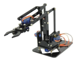

- # BionicGlove

[Versão traduzida automaticamente para Português](https://github-com.translate.goog/PantalaLabs/BionicGlove?_x_tr_sl=en&_x_tr_tl=pt&_x_tr_hl=pt-BR&_x_tr_pto=wapp)

## This is an early version of the readme and constantly being updated.

Please : 
* If you find bugs, please open an Issue.
* If you have a new feature in mind, please open a Issue with title "Feature Request".
* I will not respond to emails or messages sent personally regarding the Bionic Glove or the library.

Bionic Glove from Pantala Labs (http://www.pantalalabs.com) is a project of a wearable glove started at May/13/2023 that can control microcontrolled or not devices , robots, mobile apps, desktop programs (Ableton, Processing, etc), games, art installations, entertainment, etc through the interpretation of their behaviors and movements.

### Prototypes

4th proto

 |
 |

5th proto

 |

16/06/2023 Update
* piece of EVA between the main board and the hand to add comfort for long time use
* cover to protect the components

 | 

10/10/2023 Update
* a whole new design emerged. With no moving parts, thinner, lighter and easier to use.

https://www.instagram.com/p/CygAKJ8ucLL/

### Choosing the best mode of communication for your needs 

Like any other Bluetooth device, Bionic Glove sends datapack and it MUST BE RECOGNIZED and TRANSLATED.

There is still no program or app developed for the automatic recognition of the Bionic Glove. Our goal is to be recognized in as many ways as possible, each solution must carry out its recognition and translation. Maybe in the future, someone may create an specific program/app.

For while, these are two ways to communicate with the Bionic Glove:

a) ESP32 Receiver (+library): create sketches without worrying about the instance of communication and interpretation of the data. This is the alternative for all types of users including beginners. The library creates an abstraction for the data received from the Bionic Glove and implements several functionalities without the headache of complicated coding.

All applications will read from the COM port dinamically assigned to EP32. In my example, the Windows Device Manager shows COM20:

 

b) Bluetooth Dongle: the user will be responsible for receiving and manage all the data received via Serial Bluetooth. You will need an Bluetooth compatible dongle on your computer. Inside BionicGlove.h you will find the description of the data pack sent by the glove. This is for advanced users.

All applications will read from any COM dinamically assigned to Bluetooth Dongle. In my example, the Windows Device Manager shows COM24, COM25 and COM26:

 

There is no delay in using ESP + Library instead of Serial Bluetooth. The processing time consumed by ESP + Library are much smaller than the interval between messages sent by the glove.

### Library

Here you will find usage tips and an ESP32 library to the Bionic Glove.

#### Movement/position recognition:

These are all features coverd by glove. Many of them have parameters to ajust to your needs.

##### Finger tracking:
<table>

<tr>
<td>feature</td>
<td>description</td>
<td>parameter</td>
<td>response</td>
<td>range</td>
</tr>

<tr>
<td>finger position</td>
<td>each of all 4 fingers absolute position. It tracks every position of the finger</td>
<td>n/a</td>
<td>4 - one value for each finger</td>
<td>0-511</td>
</tr>

<tr>
<td>finger acceleration</td>
<td>regardless of the position of the fingers, when moving, it generates an acceleration. which increases when you start the movement and decreases as the finger returns to rest</td>
<td>n/a</td>
<td>4 - one value for each finger</td>
<td>-4.0 - +4.0</td>
</tr>

<tr>
<td>finger flick</td>
<td>everytime a high acceleration is reached when opening or closing a finger, like a flick, you can trigger a callback everytime a flick reaches a threshold</td>
<td>value</td>
<td>8 - one callback for each finger at opening or closing threshold</td>
<td>true / false</td>
</tr>

<tr>
<td>finger limits</td>
<td>everytime a finger reaches a position wide closed and/or opened, you can trigger a callback. the limits are configurable </td>
<td>percentage</td>
<td>8 - one callback for each finger at wide open or wide close</td>
<td>true / false</td>
</tr>
<tr>

</table>

##### Accelerometer tracking:
<table>

<tr>
<td>accelerometer</td>
<td>x and y axes accelerometers</td>
<td>n/a</td>
<td>2 - one value for each axle</td>
<td>-512.0 to 512.0</td>
</tr>

<tr>
<td>g force</td>
<td>x and y axes g force</td>
<td>n/a</td>
<td>2 - one value for each axle</td>
<td>-2.0 to 2.0</td>
</tr>

<tr>
<td>inclinometer</td>
<td>x and y angles</td>
<td>n/a</td>
<td>2 - one value for each axle</td>
<td>0 to 180 degrees</td>
</tr> 

<tr>
<td>angle limits</td>
<td>everytime a hand twist and reaches a threshold angle min or max, you can trigger a callback. the limits are configurable. it works like a joystick </td>
<td>angle</td>
<td>4 - one callback for X and Y axels at min or max position</td>
<td>true / false</td>
</tr>

<tr>
<td>hand knock</td>
<td>everytime you simulate a knock, like a door knock, you create a trigger inside the library. The knock can be in a horizontal or a vertical orientation and positive (up or right) and/or negative (down or left) way</td>
<td>value</td>
<td>4 - one callback for each vertical/horizontal , positive/negative </td>
<td>true / false</td>
</tr>

</table>

n/a - not available

#### Conventions:

Every method has one kind of parameter. Be careful not to mix the types of parameters or unexpected results may happen.

1. uint32_t ms - means millisseconds , you can use any unsigned long int number
2. uint8_t raw - refers to any of the raw data received in the data packet. You can use any unsigned 8 bit number, or any of the DEFINES available that starts with "DATA_" :

- #define DATA_F_INDEX 0
- #define DATA_F_MIDDLE 1
- #define DATA_F_RING 2
- #define DATA_F_LITTLE 3
- #define DATA_A_X 4
- #define DATA_A_X_G 5
- #define DATA_A_X_DEG 6
- #define DATA_A_Y 7
- #define DATA_A_Y_G 8
- #define DATA_A_Y_DEG 9
- #define DATA_A_Z 10
- #define DATA_A_Z_G 11
- #define DATA_A_Z_DEG 12
- #define DATA_SMOOTHFACTOR 13

3. uint8_t axl - refers to any of the accelerometer axle. You can use any unsigned 8 bit number, or any of the DEFINES available that starts with "AXL_"

- #define AXL_X 0
- #define AXL_Y 1
- #define AXL_Z 2

4. uint8_t f - refers to any of the fingers. You can use any unsigned 8 bit number, or any of the DEFINES available that starts with "FINGER_"

- #define FINGER_INDEX 0
- #define FINGER_MIDDLE 1
- #define FINGER_RING 2
- #define FINGER_LITTLE 3

5. uint8_t pct - refers to any data that uses percentage. You can use any unsigned 8 bit number from 1 to 100 , if allowed

6. any datatype val - any value inside the allowed range. Must read all library.

7. float trs - refers to threshold parameters. You can use any value inside the allowed range. Must read all library.

#### Bionic Glove Bluetooth Data Pack

This is how all data are transmitted. A String of 16 tokens with space separator: 

"> 88 76 89 26 7.00 0.03 90.23 38.00 0.17 87.91 244.00 1.12 0.00 0.99 <"

">"       package start

88 DATA_F_INDEX

76 DATA_F_MIDDLE

89 DATA_F_RING

26 DATA_F_LITTLE

7.00 DATA_A_X

0.03 DATA_A_X_G

90.23 DATA_A_X_DEG

38.00 DATA_A_Y

0.17 DATA_A_Y_G

87.91 DATA_A_Y_DEG

244.00 DATA_A_Z

1.12 DATA_A_Z_G

0.00 DATA_A_Z_DEG

0.99 DATA_SMOOTHFACTOR

"<"     end of package

#### Examples
All examples are separated by folder.
Even the most difficult one is a very simple sketch with a few lines.
<table>
<tr><td>  </td><td> https://youtube.com/shorts/7GeD01V1IA4 </td></tr>
<tr><td></td><td> https://youtube.com/shorts/MM-frLD72EQ </td></tr>
<tr><td></td><td> https://youtube.com/shorts/DhibsE4CeC0   https://youtube.com/shorts/4GAg0wk4kcI </td></tr>
<tr><td> </td><td> https://youtube.com/shorts/7AKSQntUIBc </td></tr>
<tr><td></td><td> https://www.youtube.com/shorts/455orbxOn7I </td></tr>
<tr><td></td><td> https://youtube.com/shorts/KNA1FbFNsik </td></tr>
<tr><td></td><td> https://www.instagram.com/reel/CydaNqSOUjY/?utm_source=ig_web_copy_link&igshid=MzRlODBiNWFlZA== </td></tr>
</table>

### How to Wear

~~ http://youtube.com/shorts/VhoTej8YEuo ~~ (deprecated)

~~Adjust so that the notches joining got exactly perpendicular to the glove support plate at the fingers middle position. The position of the main plate is also very important for the correct functioning of the glove. Adjust it forwards or backwards until the fingers and the joints have full free movement.~~

### How to Power it

Every mobile equipment has power coupled to the body of the device and firmly attached. Sometimes even inside the device itself.

There are two possibilities to power up the Bionic Glove:

1. using batteries, power packs or a 5VDC adapters (never more than 5V). Batteries and Power Packs must be firmly attached to the users´s arm. I stongly advise use this method. Incase of Power Adapters, zip tie the chord to a Bionic Glove´s corner as shown below.

 

2. ~~USB power.In this case, I strongly advise using a zip tie to hold the first turn of the wire. I do not recommend using this method because the USB connector will fail in a very short time. Even though it's the strongest USB connector, it's not made for moving devices.~~

~~~~

### Connections
#### ESP Receiver

1. turn on your receiver (the esp32 will only work if correctly powered by a source of at least 1A);
2. turn on Bionic Glove;
3. pay attention to the blue led on Bionic Glove. It will remain turned on for 2 seconds. At this time keep your glove horizontal and at rest to calibrate the accelerometer;
4. after the Bionic Glove will try to connect to the ESP32 Receiver. At this moment the blue led at Bionic Glove may start blinking fast, indicating that the ESP32 Receiver should already be on and waiting to be paired. The blue led will stop blinking as soon as the two devices are paired;
5. after paired, Bionic Glove will blink the blue led at every 3 seconds indicating that it is working and transmitting. 
6. to make sure everything is working , use Putty (or arduino serial monitor) to monitor the serial port.

##### REMEMBER: NEVER, NEVER
1. never connect your ESP32 to the external power source (VIN) together with the USB cable! 
This will damage your microcontroller. There is an specific USB cable to do this task.
2. never feed VIN with more than 5V. There is a high risk to damage your microcontroller.

#### Dongle Receiver
1. connect the Dongle to an USB port;
2. turn on Bionic Glove with tactile switch 1 pressed
3. pay attention to the blue led. It will remain turned on for 2 seconds. At this time keep your glove horizontal and at rest to calibrate the accelerometer. You can release the switch 1 anytime here;
4. now the Bionic Glove will connect to the Dongle;
5. to make sure everything is working , use Putty (or arduino serial monitor) to monitor the serial port.

#### Putty

PuTTY is an SSH and telnet client for the Windows platform. https://www.putty.org/ .

Download and install.

Run it and repeat this configuration:

 

Serial line : if you are using ESP + ESP Setup , go to step 1 and write the same port. If you are using Dongle Setup, choose one of the available com ports (in my case COM26). You have to try all 3 available. 

Speed: 38400

Connection type: Serial

You can save your configuration for later tests or just Open.

Now, a black window should appear with all data sent by the glove.

This is the datapack sent by ESP32 Receiver + Library

And from Dongle

If the data do not appear, you must start a troubleshot routine to find where is the missing link.

.

.

.

.

#### Ableton
There is a Max4Live component called BionicGlove freely available inside examples/ableton folder.

It abstracts main Bionic Glove behavior. This component reads directly from Bluetooth serial port.

There is an important additional configuration that you must make sure to use the Bionic Glove correctly: Bluetooth port speed.

On Windows , open Device Manager. Double click on desired Bluetooth port:

Click on 2nd tab "Port Configuration" and change Bits per second to 115200:

##### Max4Live <-> Ableton

By default Max4Live will not map controls directly to Ableton. But there is a way to create a new Control Surface like any other Midi Controller and map thru a MIDI loop / virtual MIDI:

WINDOWS / LoopMIDI

In this situation the M4L component will send a MIDI message to LoopMIDI and Ableton will receive it from LoopMIDI thru MIDI From/All Ins.

1. Download and install https://www.tobias-erichsen.de/software/loopmidi.html

2. Configure a new LoopMIDI port name. Ex : M4L

3. Now send the MAX4Live signal to M4L midiloop port. After that, Ableton will be capable to listen any message sent by BionicGlove.

4. Right-click on the BionicGlove control you want to map, and choose the EDIT MIDI MAP option. Do the mapping to the slave control.

